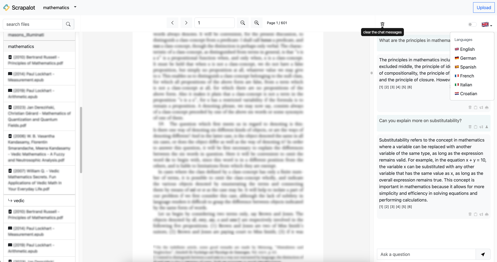
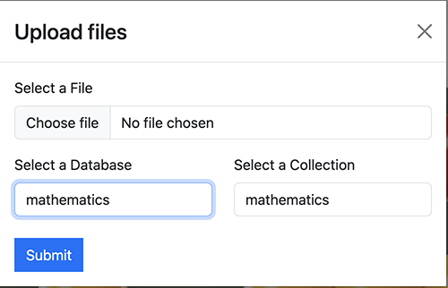
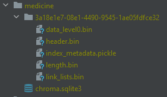

# Scrapalot Chat

Scrapalot Chat is CLI and UI Web app for chatbot question-answering experience over your document database.
Without an internet connection, using the power of LLMs.
100% private, no data leaves your
execution environment at any point.
You can ingest documents and ask questions without an internet connection!
If supports text-to-speech (over CLI), and `question`, `answer`, and `source documents`
translations using Google Translate from 🌍 English 🏴󠁧󠁢󠁥󠁮󠁧󠁿 written documents to German 🇩🇪, Spanish 🇪🇸, French 🇫🇷, Italian 🇮🇹, Croatian 🇭🇷.




## Discord server

[scrapalot-chat](https://discord.gg/mmuCqzFXs7)

## How is it working?

### Ingestion of documents to the database

#### Env variables

Copy the `example.env` template into `.env`

```shell
cp example.env .env
```

and edit the variables appropriately in the `.env` file.

```ini
OS_RUNNING_ENVIRONMENT: Operating system your application is running on.

INGEST_PERSIST_DIRECTORY: is the folder you want your vectorstore in
INGEST_SOURCE_DIRECTORY: from where books will be parsed
INGEST_EMBEDDINGS_MODEL: SentenceTransformers embeddings model name (see https://www.sbert.net/docs/pretrained_models.html)
INGEST_CHUNK_SIZE: default chunk size of texts when performing an ingest
INGEST_OVERLAP: default chunk overlap of texts when performing an ingest
INGEST_TARGET_SOURCE_CHUNKS: The amount of chunks (sources) that will be used to answer a question, defaults to 6 (decrese if you have less resources).

MODEL_TYPE: supports llamacpp, gpt4all, openai, huggingface
MODEL_ID_OR_PATH: Path to your gpt4all or llamacpp supported LLM
MODEL_N_CTX: Token context window. Maximum token limit for the LLM model
MODEL_TEMPERATURE: Temperature between 0.0 & 1.0. If 0 it will return exact answers from the books
MODEL_USE_MLOCK: If this value is set to 1, the entire model will be loaded into RAM (avoid using the disk but use more RAM),
if you have little RAM, set this value to 0
MODEL_VERBOSE: Turn on or off model debugging
MODEL_N_BATCH:  The number of tokens in the prompt that are fed into the model at a time. The lower this value, the less hardware resources will be required,
but the query may be very slow; a high value, on the other hand, speeds things up at the cost of higher memory usage.
Optimal value differs a lot depending on the model (8 works well for GPT4All, and 1024 is better for LlamaCpp)
MODEL_TOP_P: The top-p value to use for sampling.
MODEL_ANSWER_N_WORDS: How many max words will be returned in the answer, defaults to 200 (decrese if you have less resources)

TRANSLATE_QUESTION: Whether or not turn on translation of questionto english. Based on GoogleTranslate HTTP calls.
TRANSLATE_ANSWER: Whether or not turn on translation of answers from english to your language
TRANSLATE_SRC_LANG: If you want to translate answers from this language
TRANSLATE_DST_LANG: If you want to translate answers to this language

CLI_COLUMN_WIDTH: How wide will be each column when printing subdirectories of database or source documenets
CLI_COLUMN_NUMBER: How many columns by default will be shown in CLI

DB_GET_ONLY_RELEVANT_DOCS: If this is set to `true` only documents will be returned from the database. Program won't go through the process of sending chunks to the LLM.

OPENAI_USE: Whether to use this model or not, if yes, different embeddings should be used

GPU_IS_ENABLED: Whether or not your GPU environment is enabled.

OPENAI_API_KEY: OpenAI key for http calls to OpenAI GPT-4 API
HUGGINGFACEHUB_API_TOKEN: Token to connect to huggingface and download the models
GPT4ALL_BACKEND: backend type of GPT4All model. Can be gptj or llama (ggml-model-q4_0.bin)
```

Note: because of the way `langchain` loads the `SentenceTransformers` embeddings, the first time you run the script
it will require internet connection to download the embeddings model itself.

#### Supported files

For each set of documents, create a new sub-folders (1 level) in the `source_documents` folder and place the files inside sub-folders.
The supported extensions are:

- `.csv`: CSV,
- `.docx`: Word Document,
- `.doc`: Word Document,
- `.enex`: EverNote,
- `.eml`: Email,
- `.epub`: EPub,
- `.html`: HTML File,
- `.md`: Markdown,
- `.msg`: Outlook Message,
- `.odt`: Open Document Text,
- `.pdf`: Portable Document Format (PDF),
- `.pptx` : PowerPoint Document,
- `.ppt` : PowerPoint Document,
- `.txt`: Text file (UTF-8),
- `.json`: Text file (jq_schema),

The Application also supports parsing code, for these file types:

- `.py`: Python files,
- `.java`: Java files,
- `.js`: Java Script files,
- `.html`: HTML files,

#### Conda environment (recommended)

In order to set your environment up to run the code here, first install all requirements.

It is recommended that you create a virtual environment to install all dependencies from
`requirements.txt` file, not to mix them with another Python version on your machine.

- For conda environment:

```shell
conda create --name scrapalot-chat python=3.10.11 && conda activate scrapalot-chat
```

If you want to remove the conda environment, run this:

```shell
conda remove -n scrapalot-chat --all
```

If you use conda environment, and you want to parse `epub` books, you'll have to install `pypandoc` and `pandoc` inside conda environment.

```shell
conda install -c conda-forge pypandoc
conda install -c anaconda pandoc
```

# Installation

See the OS Setup section on how to install dependencies for your specific Operating System.

```shell
pip3 install -r requirements.txt
```

# Ingesting data to the database

First you need to ingest some data to the `db` database folder by performing vectorstore embeddings.
Your `source_documents` will be shown in 4 columns listed, so you can choose which database to ingest.

```shell
python scrapalot_ingest.py
```

You will be presented with options to choose existing source directory,
create new one (where you will place your files), or just use the latest one recorded as environment
variable in the `.env` file.

This will create database embeddings:



# QA application

To start the main application most importantly is to download the proper model to the `models` folder and set `.env` variables:

```dotenv
MODEL_TYPE=llamacpp
MODEL_ID_OR_PATH=models/vicuna-13b-1.1.ggmlv3.q6_K.bin
```

Supported `MODEL_TYPE` are: `llamacpp, gpt4all, openai, huggingface`.
If you choose `openai`, you have to set `OPENAI_API_KEY` env variable.

## LLM Models

LLM models tested and placed under `models` directory:

- `gpt4all`: [ggml-gpt4all-j-v1.3-groovy.bin](https://gpt4all.io/models/ggml-gpt4all-j-v1.3-groovy.bin)
    - If you prefer a different `GPT4All-J` compatible model, just download it and reference it in your `.env` file.
    - If you prefer a llama model, download [ggml-model-q4_0.bin](https://huggingface.co/Pi3141/alpaca-native-7B-ggml/tree/main)
        - **NOTE**: you need to adapt `GPT4ALL_BACKEND`
- `llamacpp`: [WizardLM-7B-uncensored.ggmlv3.q8_0.bin](https://huggingface.co/TheBloke/WizardLM-7B-uncensored-GGML/tree/8917029d1fecd37d2c3a395d399868bfd225ff36)
- `llamacpp`: [ggml-vicuna-13b-1.1](https://huggingface.co/vicuna/ggml-vicuna-13b-1.1/tree/main)
- `llamacpp`: [koala-7B.ggmlv3.q8_0.bin](https://huggingface.co/TheBloke/koala-7B-GGML/tree/main)
- `openai`: Uses OpenAI API and `gpt-4` model
- `huggingface`: [TheBloke/guanaco-7B-HF](https://huggingface.co/TheBloke/guanaco-7B-HF)

### How to select different LLM models?

The following will provide instructions on how you can select a different LLM model to create your response:

1. For models that end with HF or have a .bin inside its "Files and versions" on its HuggingFace page.
    * Make sure you have a model_id selected. For example -> `model_id = "TheBloke/guanaco-7B-HF"`
    * If you go to its HuggingFace [Site] (https://huggingface.co/TheBloke/guanaco-7B-HF) and go to "Files and versions" you will notice model files that end with a .bin extension.
    * Any model files that contain .bin extensions will be run with the following code where the `# load the LLM for generating Natural Language responses` comment is found.
    * `model_id = "TheBloke/guanaco-7B-HF"`

      `llm = load_model(device_type, model_id=model_id)`
2. For models that contain GPTQ in its name and or have a .no-act-order or .safetensors extension inside its "Files and versions on its HuggingFace page.
    * Make sure you have a model_id selected. For example -> model_id = `"TheBloke/wizardLM-7B-GPTQ"`
    * You will also need its model basename file selected. For example -> `model_basename = "wizardLM-7B-GPTQ-4bit.compat.no-act-order.safetensors"`
    * If you go to its HuggingFace [Site] (https://huggingface.co/TheBloke/wizardLM-7B-GPTQ) and go to "Files and versions" you will notice a model file that ends with a .safetensors extension.
    * Any model files that contain no-act-order or .safetensors extensions will be run with the following code where the `# load the LLM for generating Natural Language responses` comment is found.
    * `model_id = "TheBloke/WizardLM-7B-uncensored-GPTQ"`

      `model_basename = "WizardLM-7B-uncensored-GPTQ-4bit-128g.compat.no-act-order.safetensors"`

      `llm = load_model(device_type, model_id=model_id, model_basename = model_basename)`
3. Comment out all other instances of `model_id="other model names"`, `model_basename=other base model names`, and `llm = load_model(args*)`

## Run QA application

You can start asking questions about your documents, by running:

```shell
python scrapalot_main.py --mute-stream
```

Argument `mute-stream` here indicates that LLM won't stream answer to the console but will rather generate it
at once when generation is finished. The List of available arguments are:

- `--ingest-dbname`: If you want to directly specify, which database you want to ingest without going to q/a CLI steps.
- `--collection`: Saves the embedding in a collection name. This enables you to granulate your database into a sections / tags.
  Later from the UI, you can choose a database and collection to isolate your question there.
  By default, your main collection will be named after your database name. As an example, database `medicine`
  can have collections: `allergy`, `immunology`, `anesthesiology`, `dermatology`, `radiology`..., and so on.
- `--hide-source`: Use this flag to disable printing of source documents and book chunk of document from vectorstore
  showed after answers are generated.
- `--mute-stream`: Use this flag to disable the streaming StdOut callback for LLMs.
- `--ingest-embeddings-model`: Embeddings model name
- `--model-path-or-id`: Model path
- `--ingest-chunk-size`: Chunk size of how many characters you want to chunk your documents
  (needed because LLMs limits number of input tokens)
- `--ingest-chunk-overlap`: Chunk overlap
- `--ingest-target-source-chunks`: Target source chunks
- `--log-level`: Set log level, for example `-l INFO`. This is convenient while testing various LLMs, files will be stored
  under `logs` folder.

You can also run `--help` to see available options:

```shell
python scrapalot_main.py --help
```

You need to choose index number of the `db` folder documents to indicate
which database you want to ask questions to. After which you should receive an answer.

You can enter "n" to see new chunk of the document, "s" to speak the text, or "b" to go back in the folder
structure.

## Document browser

You have and option to browse through the documents and read them per chunk by using:

```shell
python scrapalot_browse.py
```

You can also filter some documents by name, read chunks of books text, step forward pressing `"n" + Enter`, speak text pressing `"s" + Enter`.

## REST API

Scrapalot has REST API built by `fastapi` that has to be running if you want to run the UI:

```shell
python scrapalot_main_api_run.py
```

Scrapalot supports REST API to integrate UI, you can develop your own, but we support ReactJS, available when you run the API at http://localhost:8000).
Or you can use our old API created by streamlit (which will soon be deprecated):
API runs by default at port 8000, and it's required for streamlit UI to be started first, for ReactJS UI it's automatically started.
API address is manipulated by changing `API_BASE_URL` env parameter, and potentially `API_SCHEME`, `API_PORT`, `API_HOST`.

## User Interface

UI is based on `ReactJS`. To run the web you just need to run the `scrapalot_main_api_run.py`:

```shell
python scrapalot_main_api_run.py
```

UI supports specifying `database` and `collection` in the database where the questions would be asked.
UI is constantly WIP so some functionallities might be disabled. If you find any issues let me know.

# OS Setup

# CPU processor

CPU is slower than GPU, but if your system does not have this support, you will have to set `GPU_IS_ENABLED` variable to `false`.
GPU acceleration is available on `NVIDIA` graphic cards and can speed up generation of answers by 80% (depends on hardware)

## CPU (Linux):

Set `OS_RUNNING_ENVIRONMENT=linux` inside `.env` file

```shell
pip3 install -r requirements.txt
```

## CPU (Windows 10/11):

Set `OS_RUNNING_ENVIRONMENT=windows` inside `.env` file

```shell
pip3 install -r requirements.txt
```

## CPU (MacOs):

Set `OS_RUNNING_ENVIRONMENT=mac` inside `.env` file

```shell
pip3 install -r requirements.txt
```

# GPU acceleration

Most importantly is that `GPU_IS_ENABLED` variable must be set to `true`.

## GPU (Linux):

Set `OS_RUNNING_ENVIRONMENT=linux` inside `.env` file

If you have an Nvidia GPU, you can speed things up by installing the `llama-cpp-python` version with CUDA
by setting these flags: `export LLAMA_CUBLAS=1`

```shell
pip3 install -r requirements.txt
```

### Installation with OpenBLAS / cuBLAS / CLBlast

lama.cpp supports multiple BLAS backends for faster processing. Use the FORCE_CMAKE=1 environment variable to force the use of cmake and install the pip package for the desired BLAS backend (source).

Example installation with cuBLAS backend:

```shell
!CMAKE_ARGS="-DLLAMA_CUBLAS=on" FORCE_CMAKE=1 pip install llama-cpp-python
```

**IMPORTANT**: If you have already installed a cpu only version of the package, you need to reinstall it from scratch: consider the following command:

```shell
!CMAKE_ARGS="-DLLAMA_CUBLAS=on" FORCE_CMAKE=1 pip install --upgrade --force-reinstall llama-cpp-python
```

If the installation with BLAS backend was correct, you will see a `BLAS = 1` indicator in model properties.

Two of the most important parameters for use with GPU are:

- `n_gpu_layers` - determines how many layers of the model are offloaded to your GPU.
- `n_batch` - how many tokens are processed in parallel.

Setting these parameters correctly will dramatically improve the evaluation speed (see wrapper code for more details).

### Alternatives

First, you have to uninstall old torch installation and install CUDA one:
Install a proper torch version:

```shell
pip3 uninstall pytorch
pip3 install pytorch torchvision torchaudio --index-url https://download.pytorch.org/whl/cu118
```

Now, set environment variables and source them:

```shell
vim ~/.bashrc
```

```shell
export LLAMA_CUBLAS=1
export LLAMA_CLBLAST=1
export CMAKE_ARGS=-DLLAMA_CUBLAS=on
export FORCE_CMAKE=1
```

```shell
source ~/.bashrc
```

You should install the latest cuda toolkit:

```shell
conda install pytorch torchvision cudatoolkit
conda install -c conda-forge cudatoolkit pip uninstall llama-cpp-python
```

if you're already in conda env you can uninstall llama-cpp-python like this:

```shell
pip3 uninstall llama-cpp-python
```

Install llama:

```shell
CMAKE_ARGS="-DLLAMA_CUBLAS=on" FORCE_CMAKE=1 pip install --upgrade --force-reinstall llama-cpp-python==0.1.61 --no-cache-dir
```

Modify LLM code to accept `n_gpu_layers`:

```shell
llm = LlamaCpp(model_path=model_path, ..., n_gpu_layers=20)
```

Change environment variable model:

```shell
MODEL_TYPE=llamacpp
MODEL_ID_OR_PATH=models/ggml-vic13b-q5_1.bin
```

## GPU (Windows)

Set `OS_RUNNING_ENVIRONMENT=windows` inside `.env` file

```shell
pip3 install -r requirements.txt
```

Install Visual Studio 2019 - 2022 Code C++ compiler on Windows 10/11:

1. Install Visual Studio.
2. Make sure the following components are selected:
    * Universal Windows Platform development
    * C++ `CMake` tools for Windows
3. Download the `MinGW` installer from the [MinGW website](https://sourceforge.net/projects/mingw/).
4. Run the installer and select the `gcc` component.

You can use the included installer batch file to install the required dependencies for GPU acceleration, or:

1. Find your card driver here [NVIDIA Driver Downloads](https://www.nvidia.com/download/index.aspx)
2. Install [NVidia CUDA 11.8](https://developer.nvidia.com/cuda-11-8-0-download-archive?target_os=Windows&target_arch=x86_64)
3. Install `llama-cpp-python` package with `cuBLAS` enabled. Run the code below in the directory you want to build the package in.
    - Powershell:
    ```powershell
    $Env:CMAKE_ARGS="-DLLAMA_CUBLAS=on"; $Env:FORCE_CMAKE=1; pip3 install llama-cpp-python --force-reinstall --upgrade --no-cache-dir
    ```

    - Bash:
    ```bash
    CMAKE_ARGS="-DLLAMA_CUBLAS=on" FORCE_CMAKE=1 pip3 install llama-cpp-python --force-reinstall --upgrade --no-cache-dir
    ```

4. Enable GPU acceleration in `.env` file by setting `GPU_IS_ENABLED` to `true`
5. Run `scrapalot_ingest.py` and `scrapalot_main.py` as usual

If the above doesn't work for you, you will have to manually build llama-cpp-python library with CMake:

1. Get repo `git clone https://github.com/abetlen/llama-cpp-python.git`,
    - switch to tag this application is using from `requirements-*.txt` file:
    - uninstall your local llama-cpp-python: `pip3 uninstall llama-cpp-python`
2. Open `llama-cpp-python/vendor/llama.cpp/CMakeList.txt` in text editor and add
   `set(LLAMA_CUBLAS 1)` to the line `178` before `if (LLAMA_CUBLAS) line`.
3. Install [CMake](https://cmake.org/download/)
4. Go to `cd llama-cpp-python` and perform actions:
    - perform `git submodule update --init --recursive`
    - `mkdir build` and `cd build`
5. Build llama-cpp-python yourself:
    ```shell
    cmake -G "Visual Studio 16 2019" -A x64 -D CUDAToolkit_ROOT="C:/Program Files/NVIDIA GPU Computing Toolkit/CUDA/v11.8" ..
    ```
6. Position CLI to this project and install llama from the folder you build, let's say `pip3 install ../llama-cpp-python/`

# Docker

To run REST API and UI in docker `docker-compose.yml` is used. Models, and documents are mounted as volumes so you don't have to copy them
to the container.

1. Put your data in `models` / `source_documents` in the project root folder
2. If you want to do it manually, you can run service by service, inside docker compose.
   This is advisable because it takes some time for the REST API to initialize LLM.

# How does this app works?

Selecting the right local models and the power of `LangChain` you can run the entire pipeline locally, without any data
leaving your environment, and with reasonable performance.
Note: you could turn off your internet connection, and the script inference
would still work. No data gets out of your local environment.

```
docker-compose up -d scrapalot-chat-api
```

```
docker-compose up -d scrapalot-chat-web
```

# System Requirements

## Python libraries

1. [x] langchain: LangChain is a framework for developing applications powered by language models
2. [x] gpt4all: A free-to-use, locally running, privacy-aware chatbot. No GPU or internet is required.
3. [x] chromadb: A vector database, capable of embedding text
4. [x] llama-cpp-python: Python bindings for CPP. Offers a web server which aims to act as a drop-in replacement for the OpenAI API
5. [x] urllib3: A powerful, sanity-friendly HTTP client for Python.
6. [x] pdfminer.six: A library for extracting text, images, and metadata from PDF files.
7. [x] python-dotenv: Reads key-value pairs from a .env file and adds them to the environment variables.
8. [x] unstructured, extract-msg, tabulate, pandoc, pypandoc, tqdm: Libraries related to handling and manipulating various data formats, tabulating data, and providing progress bars.
9. [x] deep-translator: A flexible free and unlimited library to translate between different languages in a simple way using multiple translators.
10. [x] openai, huggingface, huggingface_hub, sentence_transformers, transformers: Libraries related to machine learning and natural language processing, particularly for working with transformer
    models like GPT and BERT.
11. [x] bitsandbytes, safetensors: Libraries that seem related to operations with bits, bytes, and tensors, but I can't find more detailed information as of my last update.
12. [x] pyttsx3: A text-to-speech conversion library.
13. [x] fastapi, uvicorn, gunicorn, python-multipart: Libraries for building APIs with Python and deploying them.
14. [x] streamlit, streamlit-chat: Libraries to quickly create custom web apps for machine learning and data science projects.
15. [x] psutil: A cross-platform library for accessing system details and process utilities.

## Python Version

To use this software, you must have minimum Python `3.10` or later installed. Earlier versions of Python will not compile.

## C++ Compiler

If you encounter an error while building a wheel during the `pip install` process, you may need to install a C++ compiler on your computer.

## MacOS (Intel Chip)

When running a Mac with Intel hardware (not M1), you may run into:
`_clang: error: the clang compiler does not support '-march=native'_ during pip install`.

If so, set your `archflags` during pip install. Eg: `_ARCHFLAGS="-arch x86_64" pip3 install -r requirements.txt_`

# Disclaimer

This is a test project to validate the feasibility of a fully private solution for question answering using LLMs and Vector embeddings.
It is not production ready, and it is not meant to be used in production. The model selection is not optimized for performance,
but for privacy; but it is possible to use different models and vector stores to improve performance or just run it on `GPU`.

## Contributors

<table>
  <tr style="border: 0">
    <td style="border: 0 !important; text-align: center;"><a href="https://github.com/corran123"><br /><sub><b>corran123</b></sub></a><br /></td>
  </tr>
</table>
